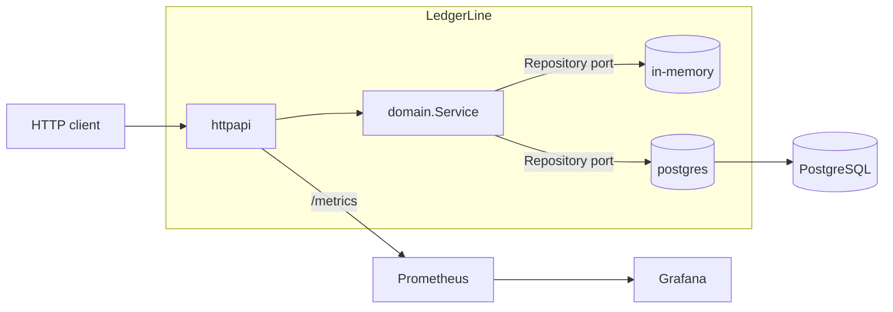

<div align="center">

# LedgerLine

**A cloud-native, double-entry payments ledger microservice.**

Built in Go with a hexagonal architecture, first-class observability, and
production-grade deployment tooling (Docker, Kubernetes, Helm, Terraform, CI/CD).

[](https://github.com/haithamEldesouky/ledgerline/actions/workflows/ci.yml)
[](go.mod)
[](LICENSE)
[](Dockerfile)

</div>

---

## Why LedgerLine?

Moving money correctly is deceptively hard: balances must reconcile exactly,
retries must not double-spend, and concurrent transfers must not corrupt state.
LedgerLine is a compact, production-shaped service that gets these
fundamentals right and ships with the operational scaffolding a platform team
expects.

- 🧮 **Correct by construction** — double-entry bookkeeping; every transfer is a
  balanced debit/credit pair, so money is conserved system-wide.
- 💵 **No float bugs** — all amounts are integer **minor units** (cents).
- 🔁 **Idempotent transfers** — an `Idempotency-Key` header makes retries safe.
- 🔒 **Concurrency-safe** — row-level locking (Postgres) / mutex (in-memory).
- 🧱 **Hexagonal architecture** — pure domain, swappable storage adapters.
- 📈 **Observable** — Prometheus metrics, structured JSON logs, health probes.
- ☁️ **Cloud-native** — distroless non-root image, Kubernetes/Helm manifests,
  Terraform, and a full CI/CD pipeline.

## Tech stack

| Area            | Choice                                                       |
| --------------- | ----------------------------------------------------------- |
| Language        | Go (standard-library `net/http` with 1.22+ routing)         |
| Storage         | PostgreSQL (`pgx`) · in-memory adapter for dev/test         |
| Observability   | Prometheus (`client_golang`), `log/slog`, Grafana dashboard |
| Packaging       | Multi-stage Docker → `distroless/static` (non-root)         |
| Orchestration   | Kubernetes manifests · Helm chart                           |
| Infrastructure  | Terraform (AWS ECR, CloudWatch, IAM)                        |
| CI/CD           | GitHub Actions (lint, test, integration, scan, build/push)  |

## Architecture

LedgerLine uses a **ports & adapters (hexagonal)** design: the domain knows
nothing about HTTP or SQL. See [docs/architecture.md](docs/architecture.md) for
the full picture and sequence diagrams.



## Quick start

### Run locally (no dependencies)

The service runs out of the box with an in-memory store:

```bash
go run ./cmd/ledgerline
# → listening on :8080 with the in-memory store
```

Then open the interactive API docs at <http://localhost:8080/docs>.

### Run the full stack with Docker Compose

Brings up the service backed by PostgreSQL, plus Prometheus and Grafana:

```bash
docker compose up --build
```

| Service      | URL                                            |
| ------------ | ---------------------------------------------- |
| API          | <http://localhost:8080>                        |
| API docs     | <http://localhost:8080/docs>                   |
| Metrics      | <http://localhost:8080/metrics>                |
| Prometheus   | <http://localhost:9090>                        |
| Grafana      | <http://localhost:3000> (anonymous viewer)     |

### Try it out

```bash
BASE=http://localhost:8080

TREASURY=$(curl -s -X POST $BASE/api/v1/accounts \
  -d '{"name":"Treasury","currency":"USD","type":"external"}' | jq -r .id)
ALICE=$(curl -s -X POST $BASE/api/v1/accounts \
  -d '{"name":"Alice","currency":"USD","type":"internal"}' | jq -r .id)

# Fund Alice with $100.00 (safely retryable).
curl -s -X POST $BASE/api/v1/transfers \
  -H "Idempotency-Key: demo-001" \
  -d "{\"fromAccountId\":\"$TREASURY\",\"toAccountId\":\"$ALICE\",\"amountMinor\":10000,\"currency\":\"USD\"}" | jq

curl -s $BASE/api/v1/accounts/$ALICE | jq          # balanceMinor: 10000
curl -s $BASE/api/v1/accounts/$ALICE/transactions | jq
```

## API

Full reference: [docs/api.md](docs/api.md) · OpenAPI: `GET /openapi.yaml` ·
Swagger UI: `GET /docs`.

| Method | Path                                   | Description                       |
| ------ | -------------------------------------- | --------------------------------- |
| POST   | `/api/v1/accounts`                     | Create an account                 |
| GET    | `/api/v1/accounts`                     | List accounts                     |
| GET    | `/api/v1/accounts/{id}`                | Get an account                    |
| GET    | `/api/v1/accounts/{id}/transactions`   | List an account's ledger entries  |
| POST   | `/api/v1/transfers`                    | Create a transfer (double-entry)  |
| GET    | `/health/live`                         | Liveness probe                    |
| GET    | `/health/ready`                        | Readiness probe                   |
| GET    | `/metrics`                             | Prometheus metrics                |

## Configuration

All configuration comes from the environment (12-factor). See
[`.env.example`](.env.example).

| Variable           | Default     | Description                              |
| ------------------ | ----------- | ---------------------------------------- |
| `HOST`             | `0.0.0.0`   | Bind address                             |
| `PORT`             | `8080`      | HTTP port                                |
| `APP_ENV`          | `development` | `development` \| `test` \| `production` |
| `LOG_LEVEL`        | `info`      | `debug` \| `info` \| `warn` \| `error`   |
| `STORAGE_DRIVER`   | `memory`    | `memory` \| `postgres`                   |
| `DATABASE_URL`     | —           | Required when `STORAGE_DRIVER=postgres`  |
| `RATE_LIMIT_RPS`   | `100`       | Per-IP token-bucket refill rate          |
| `RATE_LIMIT_BURST` | `200`       | Per-IP token-bucket burst                |
| `SHUTDOWN_TIMEOUT` | `15s`       | Graceful shutdown grace period           |

## Deployment

### Kubernetes (raw manifests)

Hardened manifests live in [`deploy/k8s`](deploy/k8s): non-root, read-only root
filesystem, dropped capabilities, resource limits, liveness/readiness/startup
probes, an HPA, and an optional `ServiceMonitor`.

```bash
kubectl apply -k deploy/k8s
```

### Helm

A configurable chart lives in [`deploy/helm/ledgerline`](deploy/helm/ledgerline):

```bash
helm install ledgerline deploy/helm/ledgerline \
  --namespace ledgerline --create-namespace \
  --set image.tag=latest \
  --set database.existingSecret=ledgerline-db
```

### Terraform

[`deploy/terraform`](deploy/terraform) provisions the supporting AWS resources
(ECR repository with scanning + lifecycle policy, CloudWatch log group, ECS task
execution role):

```bash
cd deploy/terraform
terraform init
terraform apply
```

## Observability

- **Metrics** — `/metrics` exposes Go runtime metrics plus
  `http_requests_total` and `http_request_duration_seconds` (labelled by method,
  route and status). A ready-made Grafana dashboard is in
  [`monitoring/grafana/dashboards`](monitoring/grafana/dashboards).
- **Logs** — structured JSON via `log/slog`, one line per request.
- **Health** — `/health/live` and `/health/ready` (the latter checks storage).

## Development

```bash
make help     # list all targets
make run      # run with the in-memory store
make test     # unit tests
make cover    # tests + coverage
make lint     # golangci-lint (or go vet)
make ci       # everything the CI pipeline runs
```

### Testing strategy

- **Unit tests** drive the domain through a fast in-memory adapter.
- **HTTP tests** exercise the full router via `httptest` (validation, errors,
  idempotency, rate limiting, metrics).
- **Integration tests** run the real PostgreSQL adapter against a live database
  (executed in CI via a Postgres service container; skipped locally when
  `DATABASE_URL` is unset).
- **Race detector** runs in CI on every push.

## Project structure

```
.
├── cmd/ledgerline/          # main: config, wiring, graceful shutdown
├── internal/
│   ├── domain/              # entities, rules, Repository port (no I/O)
│   ├── storage/
│   │   ├── memory/          # in-memory adapter
│   │   └── postgres/        # pgx adapter (atomic, row-locked transfers)
│   ├── httpapi/             # routing, handlers, middleware, metrics, OpenAPI
│   ├── config/              # env-based, validated configuration
│   └── observability/       # structured logging
├── db/migrations/           # SQL schema
├── deploy/
│   ├── k8s/                 # raw Kubernetes manifests (+ kustomization)
│   ├── helm/ledgerline/     # Helm chart
│   └── terraform/           # AWS infrastructure
├── monitoring/              # Prometheus config + Grafana dashboards
├── docs/                    # architecture, API reference, ADRs
└── .github/workflows/       # CI/CD pipelines
```

## Roadmap

- [ ] Cursor-based pagination for listing endpoints
- [ ] Multi-currency transfers with an explicit FX boundary
- [ ] OpenTelemetry traces alongside metrics
- [ ] Outbox pattern for publishing ledger events

## License

[MIT](LICENSE) © Haitham Eldesouky
