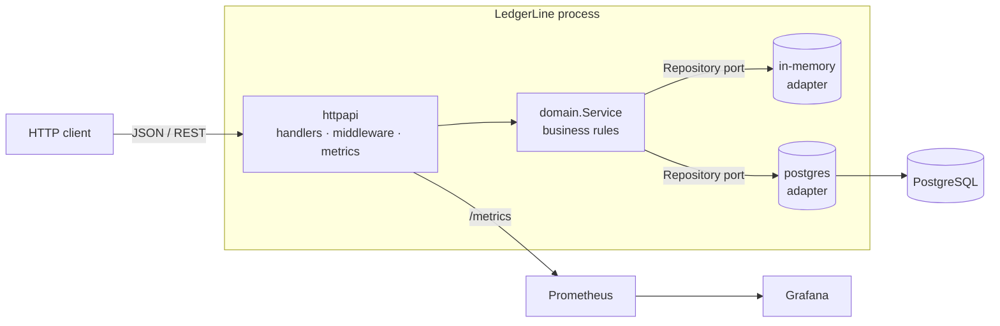
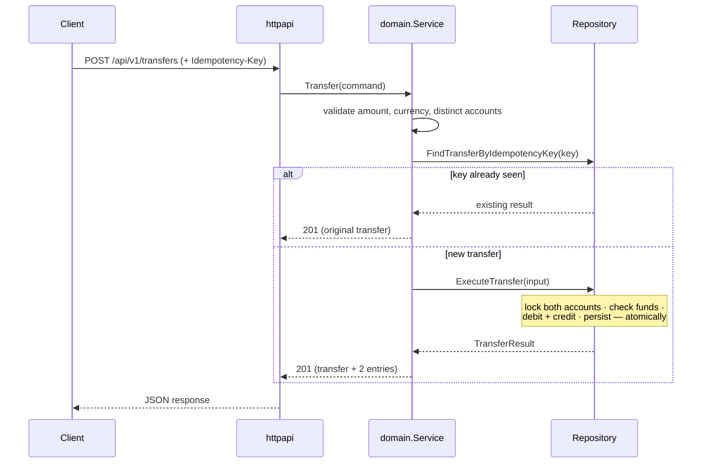

# Architecture

LedgerLine follows a **hexagonal (ports & adapters)** architecture. The domain
sits at the centre and knows nothing about HTTP or SQL; everything else plugs
into it through interfaces. This keeps the business rules pure, fast to test,
and independent of any framework or database.

## Layers

| Layer            | Package                         | Responsibility                                            |
| ---------------- | ------------------------------- | --------------------------------------------------------- |
| Domain           | `internal/domain`               | Entities, value objects, business rules, the `Repository` port |
| Adapters (driven)| `internal/storage/{memory,postgres}` | Concrete persistence implementing the port           |
| Adapters (driving)| `internal/httpapi`             | HTTP transport: routing, validation, error mapping, metrics |
| Composition      | `cmd/ledgerline`                | Wires everything together based on configuration          |
| Cross-cutting    | `internal/config`, `internal/observability` | Configuration and structured logging         |

The dependency rule is strictly inward: `httpapi` and `storage` depend on
`domain`, never the reverse. The domain defines the `Repository` interface; the
storage packages implement it.

## The double-entry model

Every movement of money is recorded as a **transfer** that produces exactly two
**ledger entries**: a `debit` on the source account and a `credit` on the
destination, of equal amount. The system-wide sum of balances is therefore
conserved by construction.

### Account types

- **internal** — customer/wallet accounts whose balance may never go negative.
- **external** — funding sources/sinks (treasury, gateway, bank settlement)
  that may carry a negative balance, modelling money entering or leaving the
  system. Money enters the ledger by transferring from an external account.

### Why integer minor units?

All amounts are stored as `int64` in minor units (cents). Floating-point types
cannot represent most decimal fractions exactly, which is unacceptable for
money. See [ADR-0002](adr/0002-money-as-integer-minor-units.md).

## Concurrency & correctness

`ExecuteTransfer` is atomic in both adapters:

- **PostgreSQL** — runs inside a transaction, locking both account rows with
  `SELECT ... FOR UPDATE` in a deterministic order to avoid deadlocks. The
  idempotency key is protected by a unique index, so duplicate submissions are
  safe even across replicas.
- **In-memory** — guarded by a mutex, with an idempotency re-check inside the
  critical section.

## Observability

- **Logs** — structured JSON via `log/slog`, one line per request.
- **Metrics** — Prometheus counters and a latency histogram at `/metrics`.
- **Health** — `/health/live` (liveness) and `/health/ready` (readiness, which
  checks the storage backend).
